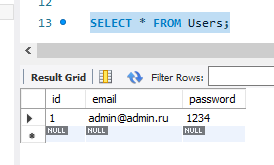
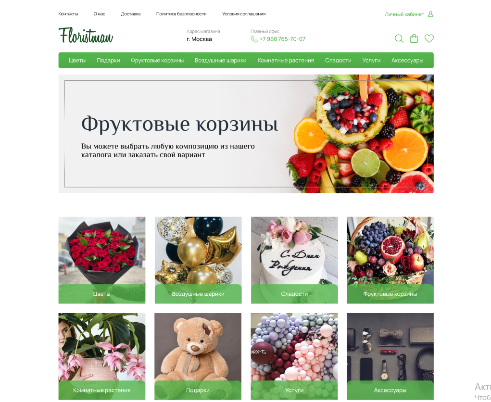

## Макет сайта с Figma

### Технологии:
1. html
2. css
3. Java Script
4. Node JS + Express 
5. PHP My Admin (MySQL)
6. WebPack  
   
### Ссылка на макет:
https://www.figma.com/file/Nkl3IWYhmkTQhPyanZ5g4J/Floristman?node-id=0%3A1  

### Установка пакетов Express, MySQL:
`npm install express body-parser mysql2`

### Тест авторизации пользователя:

ЛОГИН: admin@admin.ru 
ПАРОЛЬ: 1234 

В случае неуспешной авторизации выдаст ошибку, в случае подключения вернет на главную страницу.

Запись в Базе данных MySQL:

### Описание:
Простой проект небольшого интернет магазина. Из интересного: форма авторазации с возможностью ввести логин и пароль.  Данные магазина обновляются через JSON. Если поменять содержимое файла db.json или discounts.json - товарная полка интернет магазина поменяется.  

Данные о пользователях хрнятся в базе данных.

